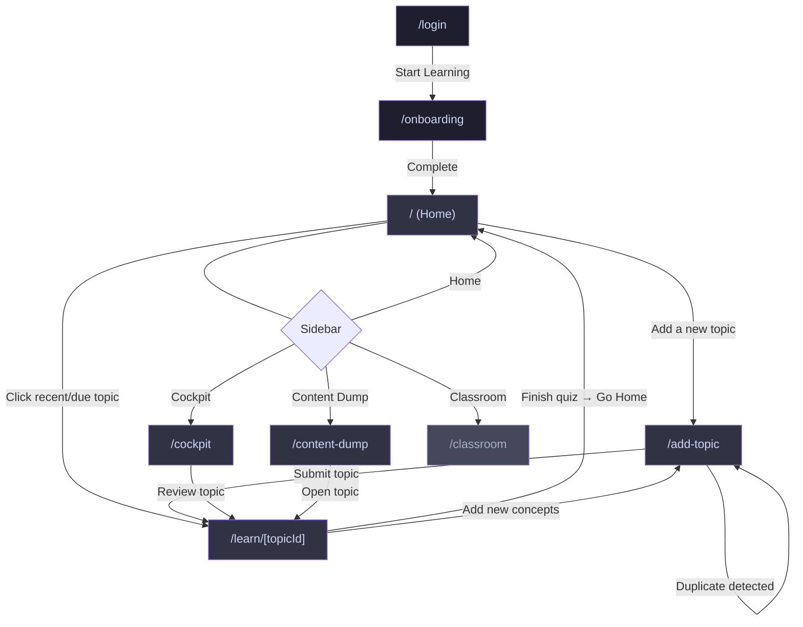
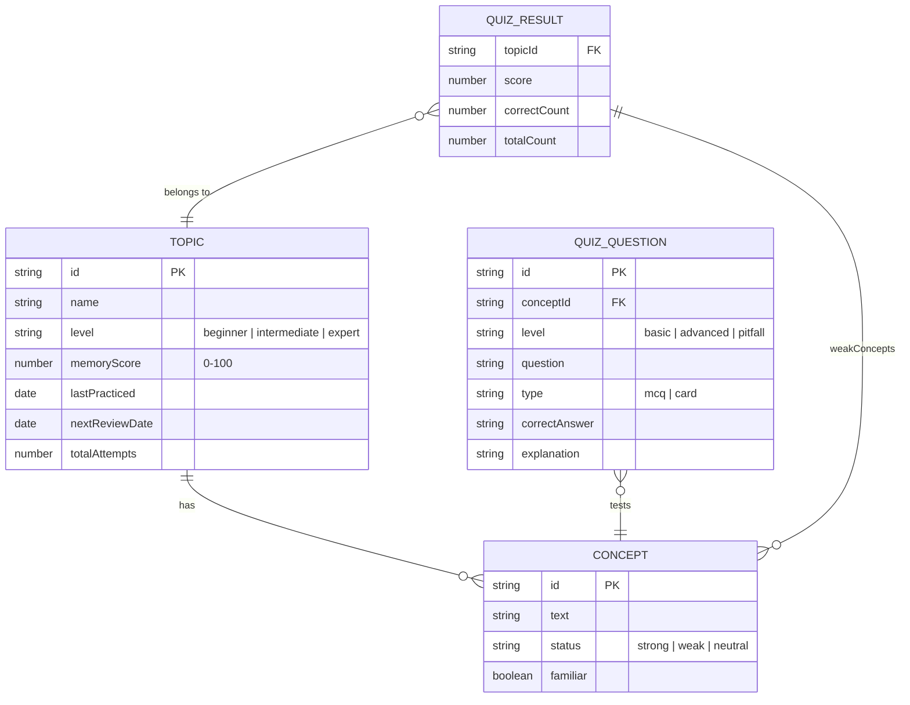

# Memora — Product Overview

> **A spaced-repetition learning platform that helps students capture what they learn and remember it forever.**

Memora is a **Next.js 14** web application with a desktop-first, AI-platform-inspired UI. Data is persisted in the browser via **localStorage**. Authentication is demo-mode (no real backend). The app uses the **Outfit** font, supports light/dark themes, and renders a persistent sidebar navigation on non-immersive pages.

---

## Architecture at a Glance

```
┌──────────────┐   localStorage    ┌────────────────┐
│  React Pages │ ◄──────────────►  │  lib/storage   │
└──────┬───────┘                   └────────────────┘
       │                                    ▲
       │                                    │
       ▼                                    │
┌──────────────┐                   ┌────────────────┐
│  Components  │                   │ lib/quiz-gen   │
│  (sidebar,   │                   │ lib/data/      │
│   ui/, auth) │                   │  quiz-data.json│
└──────────────┘                   └────────────────┘
```

| Layer | Key Files | Purpose |
|---|---|---|
| **Types** | `types/index.ts` | `Topic`, `Concept`, `QuizQuestion`, `QuizResult` |
| **Storage** | `lib/storage.ts` | CRUD for topics & quiz results in localStorage |
| **Quiz Engine** | `lib/quiz-generator.ts`, `lib/data/quiz-data.json` | Loads pre-authored questions, generates fallback MCQs |
| **UI Shell** | `components/sidebar.tsx`, `components/auth-provider.tsx`, `components/theme-provider.tsx` | Sidebar nav, demo auth, dark/light theming |

---

## Page Map



---

## Pages in Detail

### 1. `/login` — Login Page

| What | Details |
|---|---|
| **Purpose** | Entry point; demo authentication |
| **Key UI** | Centred card with Brain icon, app name, and "Start Learning" button |
| **State** | Calls `login()` from `AuthProvider`, which sets a flag in localStorage and redirects to `/onboarding` (first visit) or `/` (returning user) |
| **Sidebar** | Hidden |

---

### 2. `/onboarding` — Onboarding Wizard

| What | Details |
|---|---|
| **Purpose** | Capture the new user's motivation and study commitment |
| **Steps** | `welcome` → `motivation` → `commitment` → `ready` |
| **Key UI** | Full-screen animated step-wizard (Framer Motion). Motivation options: Exam Prep, Career Growth, Personal Interest, Other. Commitment options: 5 / 10 / 15 / 30 min/day |
| **State** | Stores `onboarded: true` in localStorage on completion, then redirects to `/` |
| **Sidebar** | Hidden |

---

### 3. `/` — Home Page

| What | Details |
|---|---|
| **Purpose** | Main landing page after login; the "what did you learn today?" prompt |
| **Key UI** | Hero heading, large "Add a new topic" CTA button, two widget cards: **Recent Activity** (last 3 topics with memory-score dot) and **Due for Review** (topics whose `nextReviewDate` ≤ now) |
| **Navigation** | "Add a new topic" → `/add-topic`. Clicking any topic card → `/learn/{topicId}` |
| **Sidebar** | Visible — Home is active |

---

### 4. `/add-topic` — Add Topic Flow

| What | Details |
|---|---|
| **Purpose** | Multi-step wizard to create a new topic with concepts |
| **Steps** | `topic` → `level` → `concepts` → `confidence` → `source` → `confirmation` |
| **Key UI** | Animated step transitions. Topic name input, level selection (Beginner / Intermediate / Expert with concept previews), concept checklist with custom add, confidence slider (1-4), learning source picker, summary confirmation card |
| **Duplicate Detection** | If a topic with the same name already exists, an `AlertDialog` offers "Continue existing" or "Start fresh" |
| **State** | On submit, creates a `Topic` object via `storage.addTopic()`. On "Start Quiz" from confirmation, navigates to `/learn/{topicId}` |
| **Sidebar** | Hidden (immersive flow) |

---

### 5. `/learn/[topicId]` — Learn / Quiz Page

| What | Details |
|---|---|
| **Purpose** | The core learning loop — review concepts, take a quiz, see results |
| **Phases** | `review` → `quiz` → `result` |
| **Review phase** | Displays topic name, concept checklist (toggle familiar/unfamiliar), ability to add/delete concepts |
| **Quiz phase** | Loads questions from `quiz-data.json` filtered by `conceptId` + `level`, with dynamic fallback generation. MCQ cards with answer reveal, correct/incorrect feedback, and explanation |
| **Result phase** | Shows score (trophy icon), correct/total count, lists weak concepts, and offers "Go Home" or "Add New Concepts" actions |
| **State** | Updates `memoryScore`, `lastPracticed`, `nextReviewDate`, `totalAttempts` on the topic via `storage.updateTopic()`. Saves `QuizResult` via `storage.addQuizResult()` |
| **Sidebar** | Hidden (immersive flow) |

---

### 6. `/cockpit` — Cockpit Dashboard

| What | Details |
|---|---|
| **Purpose** | At-a-glance progress overview of all learning activity |
| **Key UI** | **Stats grid** (4 cards): Total Topics, Avg. Memory %, Due count, Total Sessions. **Priority Review** panel: lists overdue topics with "Review" button → `/learn/{id}`. **Knowledge Base** panel: most recently practiced topics with memory-score badges (Strong / Average / Weak) |
| **State** | Reads all topics from `storage.getTopics()` on mount |
| **Sidebar** | Visible — Cockpit is active |

---

### 7. `/content-dump` — Content Dump (Topic Library)

| What | Details |
|---|---|
| **Purpose** | Browse, search, filter, and manage all saved topics and their concepts |
| **Key UI** | Search bar, tag filter chips (Coding, Science, Theory, Practice, History, Math), topic cards showing name + assigned tags + concept count. Expandable concept list per topic with individual concept stats (dummy). **Delete topic** via `AlertDialog` confirmation — also removes associated quiz data |
| **State** | Full CRUD on topics. `storage.deleteTopic()` + `storage.deleteQuizResultsForTopic()` |
| **Sidebar** | Visible — Content Dump is active |

---

### 8. `/classroom` — Classroom (Coming Soon)

| What | Details |
|---|---|
| **Purpose** | Placeholder for future teacher/classroom features |
| **Key UI** | Simple heading + "Coming Soon" message |
| **Sidebar** | Visible — Classroom is active (greyed out with "Soon" badge) |

---

## Sidebar Navigation

The sidebar (`components/sidebar.tsx`) is a **persistent, collapsible navigation rail** that appears on all dashboard pages and hides during immersive flows.

| Item | Route | Icon | Notes |
|---|---|---|---|
| Home | `/` | `Home` | Default landing |
| Cockpit | `/cockpit` | `Activity` | Progress dashboard |
| Content Dump | `/content-dump` | `Library` | Topic library |
| Classroom | `/classroom` | `GraduationCap` | Disabled, "Soon" badge |

**Hidden on:** `/login`, `/onboarding`, `/add-topic`, `/learn/*`

**Footer:** Theme toggle (light/dark) + Logout button.

---

## Data Model



---

## Key User Journeys

### First-Time User
```
Login → Onboarding (motivation + commitment) → Home → Add Topic → Level Select
→ Concept Selection → Confidence → Source → Confirmation → Quiz → Results → Home
```

### Returning User — Review Due Topic
```
Login → Home (sees "Due for Review" card) → Click topic → Learn Page (review concepts)
→ Start Quiz → Results → Home
```

### Returning User — Browse & Manage
```
Login → Home → Sidebar → Content Dump → Search/Filter topics → Expand topic
→ View concepts → Delete topic (or) Click to quiz
```

### Progress Check
```
Login → Sidebar → Cockpit → View stats → Click overdue topic → Review quiz → Home
```
